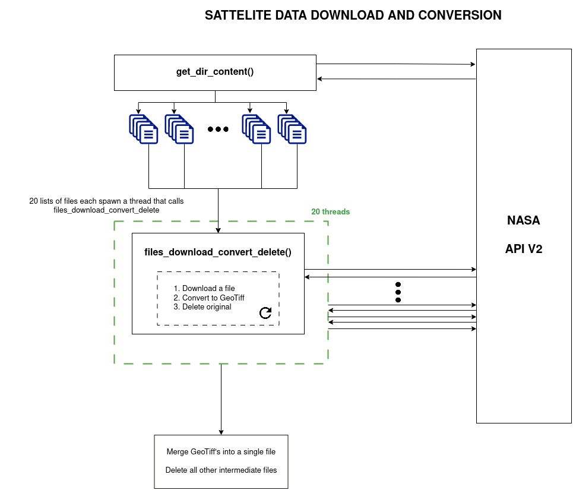

#Light Pollution Map

This repository contains:

1. NASA VPN64A2 API data download service, which downloads data and converts it to a GeoTIFF
2. Light pollution model based on R.H. Garstang's 1989 model
3. Map generation service, which takes the GeoTIFF file and processes it by applying the light pollution model, and then applies a gradient and turns it into a PNG image. In future this will be a GeoTIFF file.

### Demonstration GIF of light pollution as produced by the model as distance increases.

###  Light pollution data for the UK. This is a test and not an accurate result at the moment.

### Satellite download service design diagram

Immediate goals:
- Leaflet demo
- Calibration
- Deployment